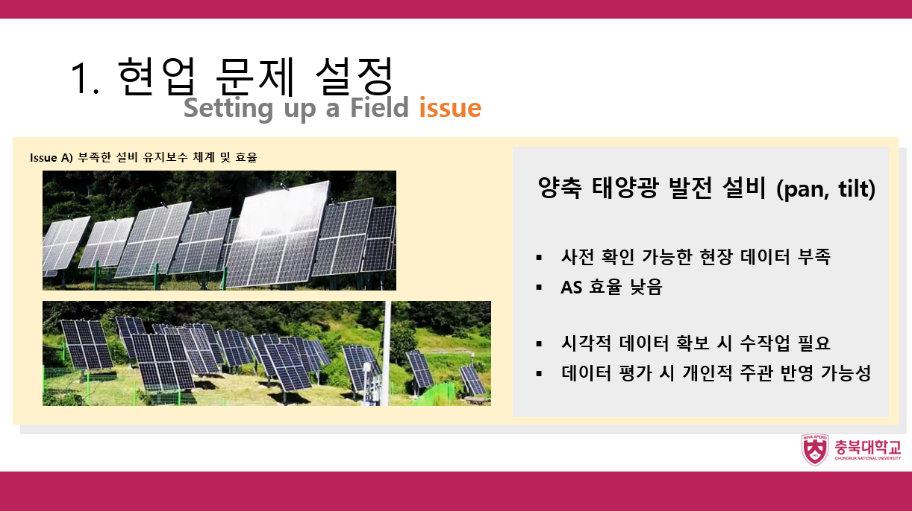
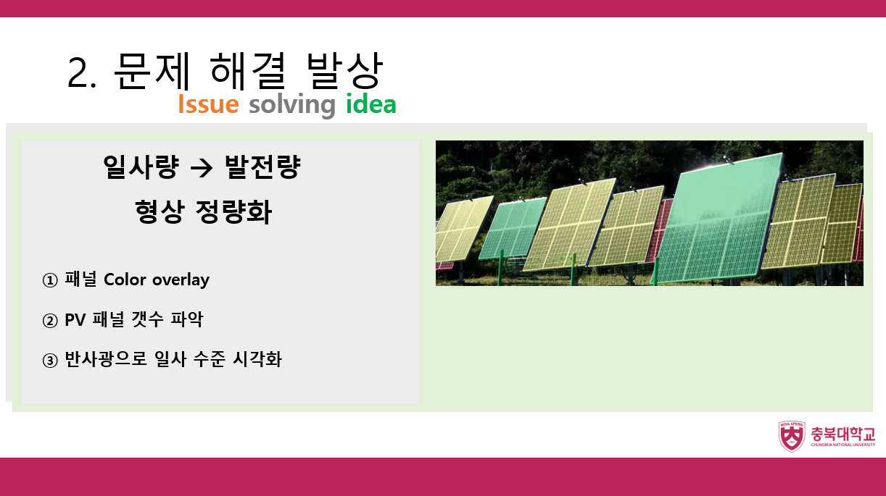
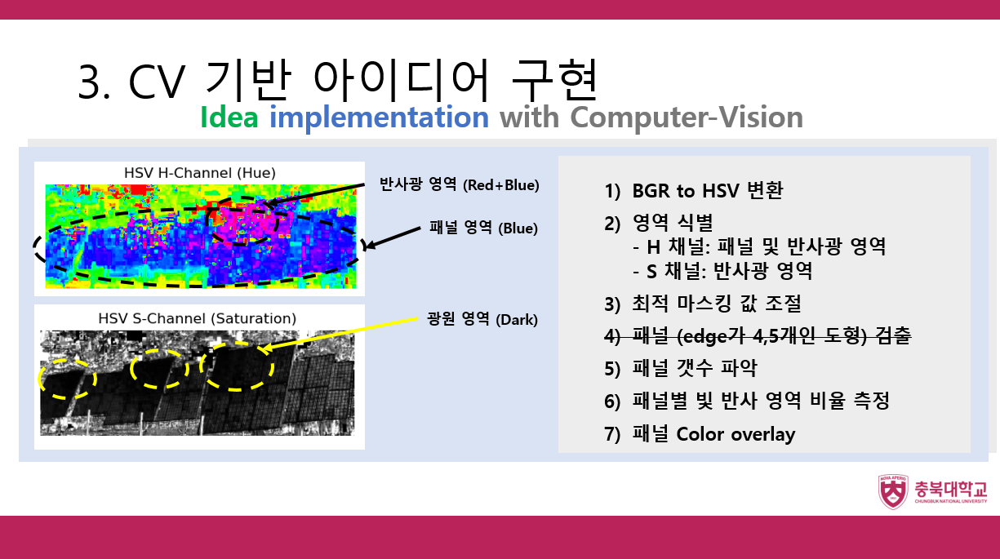
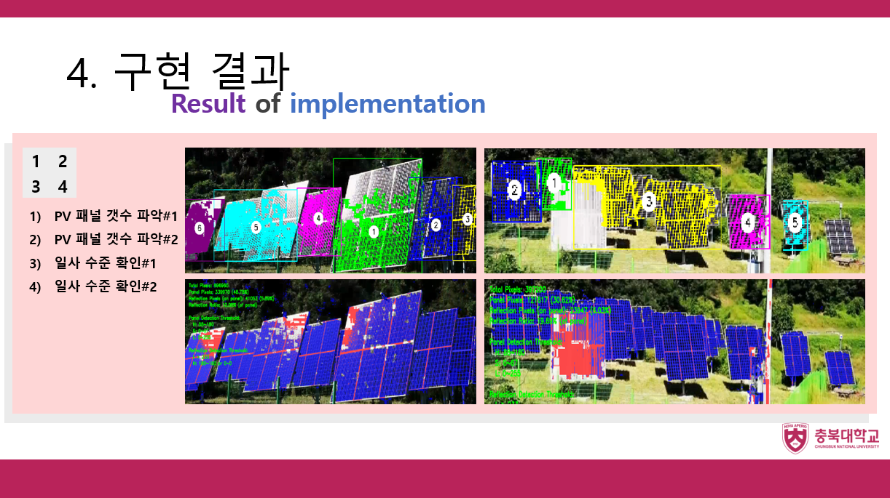
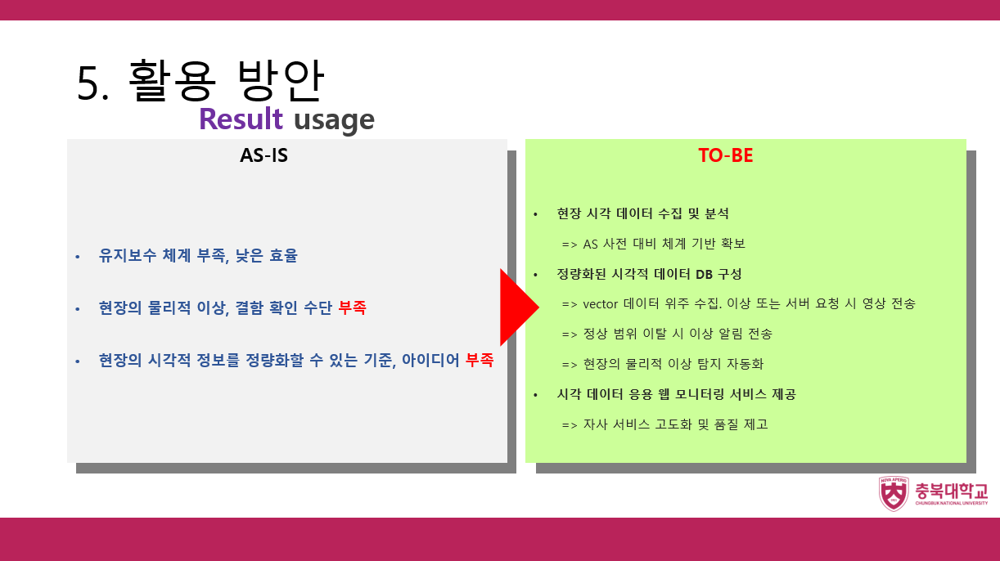

# 주제  
- 산업컴퓨터비전 과목 중간 프로젝트 수행  

- 양축 트래커 설비 유지보수 체계 및 효율 개선 방안   

## 서론  
- 중간 프로젝트 직전까지 배운 opencv 기법 활용  

- 현업에서 발생하는 문제 중 CV 기법을 활용해 해결할 수 있는 문제, 해결 방안 구현  

## 본론  
### 🅿️ 현업 문제 설정  

- pan(Y축 회전), tilt(X축 회전) 두 가지 동작  

#### AS-IS 
- **비효율적 공수 투입**: 패널 파손 수리, 청소 등 현장 조치 전 영상의 육안 식별 과정이 반드시 선행됨    

- **대략적인 수치 산정**: 육안 식별만으로 패널, 트래커 상태 수치화 시 한계가 있음      

- **작업자 주관 반영 가능성**: 수치화 수작업 시 결과에 업무 수행자 주관 반영 가능성 존재    

#### TO-BE  
- 기존 프로세스(**[현장(발전소) 방문] -> [패널, 트래커 상태 식별] -> [유지보수]**) 의 개선 및 간소화  
- 수치화된 데이터를 시계열 차트로 표현. 체계 확보 
### 🅱️ 문제 해결 발상  

- 목표: 현장 상태 정량화   

- 정량화 대상  

  - 트래커 패널 갯수  

  - 패널별 반사광 수준 (%) => 일사 수준 파악   

### ℹ️ CV 기반 아이디어 구현  
  
#### 패널 갯수 식별  
- BGR->HSV 변환: 입력 영상에서 패널 색상(청색) 식별하고자 채도(Hue) 채널 추출  
- Edge 추출: 패널 경계 edge 추출을 위해 Canny Edge 적용  
- Edge 확대: 검출된 edge를 3x3 커널(마스크) 사용하여 확대  
- 패널 경계 추출: Contour 계산  
#### 패널 반사광 수준 식별  
- BGR->HSV 변환: 입력 영상에서 반사광 영역 확인하기 위해 명도(Saturation) 채널 추출  

- 
- 

### 🅰️ 구현 결과  
  
#### 패널 갯수 식별  
- Hue 채널

### ✅ 활용 방안  
  

- 영상 식별 통해 발전소 현장에서 확인된 양축 트래커 갯수, 패널 반사광 수준 등의 정량화가 목표  
  

## 고찰  
### 문제 설정  
- CV기법 적용할 주제 탐색 및 설정 ~ 문제 해결하는 과정에서 동기 부여가 되었음    
- 배운 내용 복기하는 효과적인 방법이나,    
- 
- 해결 방안을 추상적으로 구상하고, 구상한 방안 구현하는 과정에서 LLM 코드 작성 및 검토 사용함       
### 